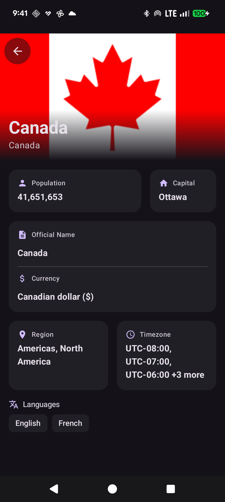
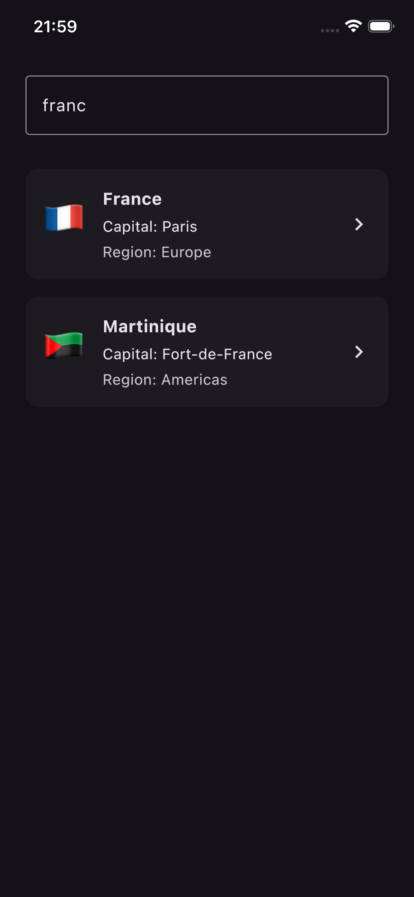

# GlobalScout 🌍

**GlobalScout** is a modern, cross-platform mobile application built with **Kotlin Multiplatform (KMP)** and **Compose Multiplatform**. It allows users to explore detailed information about countries worldwide, featuring a polished, responsive UI and robust data handling.

<!-- Add screenshots/visuals here -->
<p align="center">
  
  
</p>

## ✨ Core Features

- **Country Exploration**: Browse a comprehensive list of countries with flags, capitals, and regions.
- **Smart Search**: Filter countries instantly by **Name**, **Capital**, or **Region**.
- **Rich Details View**:
  - **Bento Grid Layout**: A beautiful, asymmetrical grid displaying key metrics (Population, Capital, etc.).
  - **Collapsible Cards**: Smart UI that handles large data sets (like Timezones) without cluttering the screen.
  - **Interactive Elements**: Clickable cards for expanded views (e.g., full timezone lists).
  - **Glassmorphic Header**: A visually striking header with blurred backgrounds and clear typography.
- **Dark Mode Support**: Fully compliant with system themes using Material 3.
- **Responsive Design**: Adapts layout logic based on data content (e.g., dynamic card resizing for long capital names).

## 🔮 Roadmap / TODO

- [ ] **Interactive Map Previews**: Visualize country location on a map.
- [ ] **Bordering Country Navigation**: Navigate to neighbors directly from the detail screen.
- [ ] **Audio Playback**: Listen to national anthems.

## 🛠️ Tech Stack

- **Language**: [Kotlin](https://kotlinlang.org/) (100% pure Kotlin codebase).
- **UI Framework**: [Compose Multiplatform](https://www.jetbrains.com/lp/compose-multiplatform/) (Android & iOS).
- **Architecture**: Clean Architecture + MVVM.
- **Dependency Injection**: [Koin](https://insert-koin.io/).
- **Networking**: [Ktor](https://ktor.io/).
- **Image Loading**: [Coil 3](https://coil-kt.github.io/coil/).
- **Concurrency**: Kotlin Coroutines & Flow.
- **Design System**: Material 3 (Material You).

## 🏗️ Architecture & Design Patterns

GlobalScout follows **Clean Architecture** principles to ensure separation of concerns, testability, and maintainability.

### Layers

1.  **Domain Layer** (`commonMain/domain`):
    - Contains business entities (`Country`, `CountryDetail`).
    - Defines interactions and repository interfaces.
    - Pure Kotlin, no platform dependencies.

2.  **Data Layer** (`commonMain/data`):
    - Implements repository interfaces (`DefaultCountryRepository`).
    - Handles data fetching via Ktor (`CountryService`).
    - Maps network DTOs to Domain models.

3.  **Presentation Layer** (`commonMain/ui`):
    - **ViewModels** (`HomeViewModel`, `CountryDetailViewModel`): Manage UI state and business logic using `StateFlow`.
    - **UI Models**: tailored data classes for view binding (`CountryUi`, `CountryDetailUi`).
    - **Composables**: Declarative UI components using Jetpack Compose.

### Key Patterns

- **Repository Pattern**: Centralizes data access, abstracting the source (Network).
- **MVVM (Model-View-ViewModel)**: Decouples UI from logic.
- **Unidirectional Data Flow (UDF)**: UI observes `UiState` (Loading/Success/Error) and sends events to the ViewModel.
- **Dependency Injection**: Koin modules manage object graph and lifecycle.

## 🚀 Getting Started

1.  **Clone the repository**:
    ```bash
    git clone https://github.com/rtarik/GlobalScout.git
    ```
2.  **Open in Android Studio** (Ladybug or later recommended).
3.  **Run Android App**: Select `composeApp` configuration and run on emulator.
4.  **Run iOS App**: Open `iosApp/iosApp.xcodeproj` in Xcode or run via Android Studio (with KMP plugin).

---
Built with ❤️ and Antigravity using Kotlin Multiplatform.